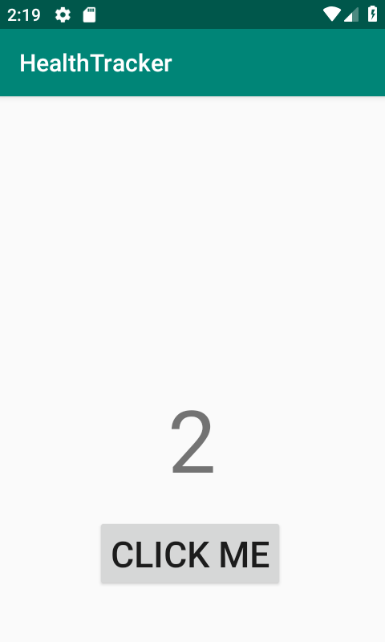
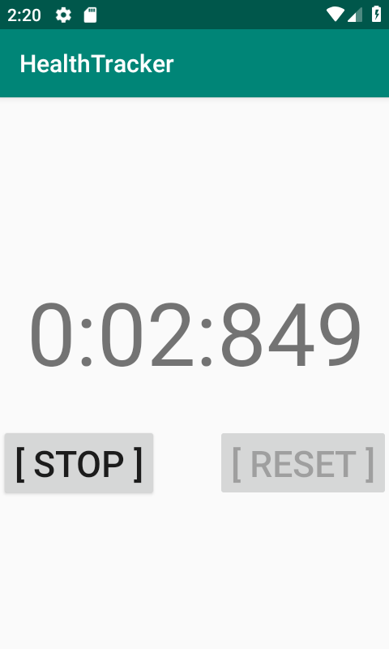
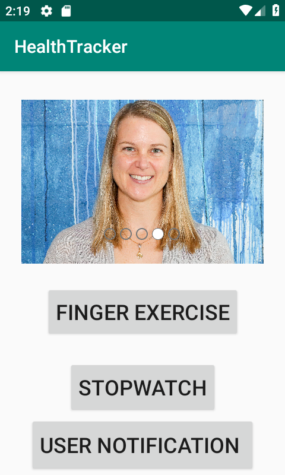
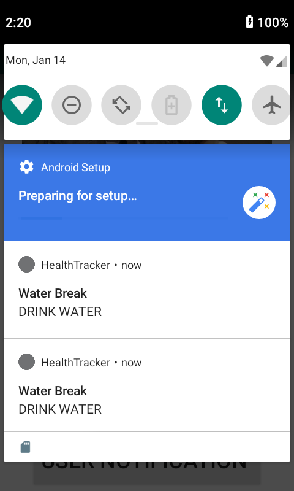
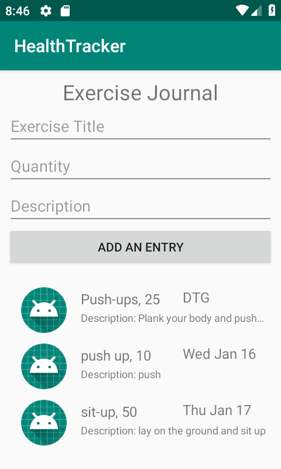

# Health Tracker
Health Tracker (Android Mobile)

## Functionality
Health Tracker performs the following activities:

`Image Carousel`
* This activity shifts from a set of images on the home activity
* At the top of our main page, we want to inspire our users with images of the type of person they can become.
* Display an image with a caption below it. (The caption should NOT be part of the image; it should be text.) Allow users to cycle through images and read the captions. 
* Pressing next should go to the next image and its caption, pressing prev should go back. 
* The app should display a (1/N), (2/N) … indicator so users know how many items are in the list.

`Stopwatch`
* This activity can start/stop and reset a stopwatch to the millisecond
* On the main page, add a stopwatch. Have a button to [Start/Pause] and [Reset] the clock. The start/pause button should toggle between saying “start” and “pause.” 
* You should only be able to reset when the stopwatch is paused.
* Have the view update as fast as possible while still leaving the buttons responsive.
* Display the clock as 0:00:00.000 so it should be able to track up to 9 hours, 59 minutes, 59 seconds and 999 milliseconds.

`Finger Exerciser`
* This activity increments an integer by 1 for each time the button is clicked.
* On the main page, display a number and a button. The number should increase when the button is clicked.

`Notifications`
* Sends a notification to the user to take a water break when the button is clicked
* Create a new activity for Notifications. Allow users to set up reminders to drink water, which should appear every 2 hours in the notification bar. (For testing, you might want to shorten this to 15 or 30 seconds.)
 
`Excercise Journal`
* This activity provides users a database to store journal entries of their workouts as they complete them
* Set up a database to contain Exercise data. Each Exercise should have a title, quantity, and description, as well as a timestamp. For testing, add a single Exercise to the database.
* Add a new Activity to hold the Exercise Diary. In that view, display all entries from the Exercise database in a ListView.
* At the top of the Exercise Diary activity, add a form that allows a user to enter data about an exercise. When they hit submit, the information about that exercise should be stored in the database and displayed in the ListView

`Navigation`
* Move Finger Exercises and Stopwatch into their own pages of your app. 
* Add buttons on the homepage to link to those pages, and ensure that the user can use the back button on the device to return to the app homepage

`Backend Spring Server`
* Add a replica of your Exercise model to the backend Spring app. 
* Create a POST route that allows creating a new Exercise, and a GET route that responds with all Exercises currently in the database. 
* When a user opens the Exercise Journal page, the app should make a request to the server to retrieve all the Exercises in the server’s database. It should display both those Exercises and the ones that are local to the device within the Journal page.
* When a user creates a new Exercise locally on their device, in addition to saving it to the local database, the app should POST it to the server.

`strings.xml`
* Remove all hardcoded strings from your UI, and instead use the strings.xml file.

`Location`
* When a user adds an exercise, they should be able to include their current location.
* Update your models appropriately, and display the location within the ListView.

`SharedPrefs`
* Ensure that the user’s username is correctly displayed throughout the app.
* Also, modify the homepage to include some key stats, such as the current finger exercise count and the total number of times the user has visited the homepage.

`Auth on the backend`
* Add auth to your Spring backend, so that users can log in.
* Require users to be logged in to post an Exercise, and associate users and exercises.

`SharedPrefs for login`
* Allow the user to log in to your app, using the login functionality for the backend.
* Store their token in SharedPrefs, and ensure it’s secret.

[Heroku backend path](https://health-tracker-web-dm.herokuapp.com/exercises)

## Change Log
1/8/2019
- Set up basic file structure
- Completed finger exerciser activity and basic layout for app.

1/9/2019
- Completed stopwatch method
- Completed image carousel method
- Separated each method into their own activities and connected by intents

1/10/2019
- Continued learning about notifications

1/13/2019
- Added notification functionality

1/15/2019
- Added exercise journal database and activity

1/16/2019
- RecyclerView added, database working.

1/17/2019
- Began adjusting Journal activity for display of API db

1/18/2019
- Completed local and server database linkages and rendering on mobile app

1/22/2019
- Read up on security. No code committed.

## Activity Screenshots
### Finger Exerciser

  

### Stopwatch

  

### Image Carousel

  

### Notifications

  

### Journal

  

## Resources
### Finger Exerciser
* https://www.viralandroid.com/2015/10/how-to-increase-integer-value-when-button-is-clicked.html

### Stopwatch
* https://code.mikeyaworski.com/java/stopwatch
* https://stackoverflow.com/questions/22742089/stackoverflow-inside-thread-stopwatch-java

### Carousel
* https://github.com/sayyam/carouselview

### Notifications
* https://gist.github.com/BrandonSmith/6679223
* https://developer.android.com/training/notify-user/build-notification
* https://stackoverflow.com/questions/9406523/android-want-app-to-perform-tasks-every-second

### Room Database
* https://medium.freecodecamp.org/room-sqlite-beginner-tutorial-2e725e47bfab

### RecyclerView
* http://www.vogella.com/tutorials/AndroidRecyclerView/article.html

### Helpful Human Collaboratrs
* A heartfelt thanks to Jessica Lovell, Evan Slaton, Zahra Mohamed and Jeff Borda helped with code for project help and generally helping me keep sane
* Special thanks to Sooz for being my ever-forgiving TA and demanding excellence in READMEs!
